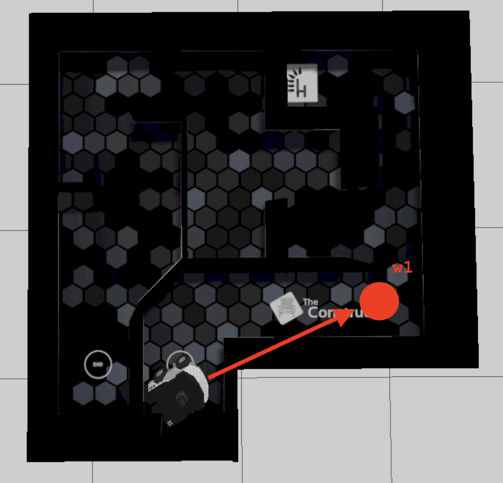

# checkpoint17_turn_controller

## Part 2 of Checkpoint 17
This project goal is to turn the robot to direction with PID controller. 
It would only turn the robot to 3 goals in the maze simulation





- To do parameter testing
```
ros2 run turn_controller turn_controller 1.0 0.1 0.0005  2>&1 >/dev/null | grep Summary
```
- Simulation
```
source install/setup.bash; ros2 run turn_controller turn_controller
```

## Part 3 of Checkpoint 17
This project goal is to turn the robot to direction with PID controller. 
It would only turn the robot to 2 goals in the real maze robot


- Real robot 
```
source install/setup.bash; ros2 run turn_controller turn_controller 2
```

Helper commands
```
ros2 topic echo /odometry/filtered --field pose.pose.position
```
```
ros2 topic echo /rosbot_xl_base_controller/odom --field pose.pose.position
```
